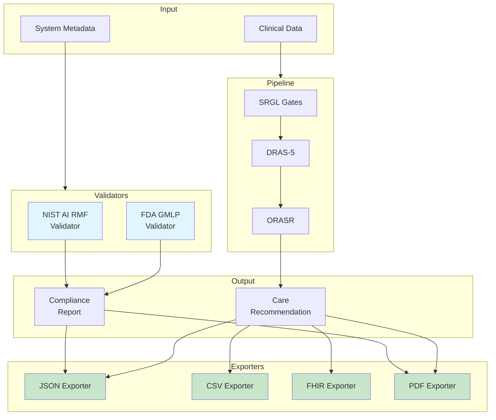

# Phase 5 Visual Guide

**Diagrams and Flowcharts for Understanding TRI-X Phase 5**

---

## Table of Contents

1. [System Architecture](#system-architecture)
2. [Data Flow Diagrams](#data-flow-diagrams)
3. [Compliance Validation Flow](#compliance-validation-flow)
4. [Export System Flow](#export-system-flow)
5. [Integration Patterns](#integration-patterns)
6. [Decision Trees](#decision-trees)

---

## System Architecture

### Overall Phase 5 Architecture

```
┌─────────────────────────────────────────────────────────────────────────┐
│ TRI-X PHASE 5 ARCHITECTURE │
└─────────────────────────────────────────────────────────────────────────┘

┌─────────────────────────────────────────────────────────────────────────┐
│ INPUT: Clinical Data + System Metadata │
└───────────────────────────┬─────────────────────────────────────────────┘
 │
 ┌───────────┴────────────┐
 │ │
 ▼ ▼
 ┌───────────────────┐ ┌───────────────────┐
 │ VALIDATORS │ │ TRI-X PIPELINE │
 │ │ │ (Phases 1-4) │
 │ ┌─────────────┐ │ │ │
 │ │ NIST AI RMF │ │ │ ┌─────────────┐ │
 │ │ Validator │ │ │ │ SRGL │ │
 │ └─────────────┘ │ │ │ (6 Gates) │ │
 │ │ │ └─────────────┘ │
 │ ┌─────────────┐ │ │ ▼ │
 │ │ FDA GMLP │ │ │ ┌─────────────┐ │
 │ │ Validator │ │ │ │ DRAS-5 │ │
 │ └─────────────┘ │ │ │ (Risk State)│ │
 │ │ │ └─────────────┘ │
 └─────────┬─────────┘ │ ▼ │
 │ │ ┌─────────────┐ │
 │ │ │ ORASR │ │
 │ │ │ (Actions) │ │
 │ │ └─────────────┘ │
 │ └─────────┬─────────┘
 │ │
 ▼ ▼
 ┌───────────────────┐ ┌───────────────────┐
 │ Compliance Report │ │ Care Recommendation│
 └─────────┬─────────┘ └─────────┬─────────┘
 │ │
 └───────────┬────────────┘
 │
 ▼
 ┌───────────────────────┐
 │ EXPORT SYSTEM │
 │ │
 │ ┌─────┐ ┌─────┐ │
 │ │JSON │ │ CSV │ │
 │ └─────┘ └─────┘ │
 │ ┌─────┐ ┌─────┐ │
 │ │FHIR │ │ PDF │ │
 │ └─────┘ └─────┘ │
 └───────────┬───────────┘
 │
 ┌───────────┴───────────┬───────────┬──────────┐
 ▼ ▼ ▼ ▼
 ┌─────────┐ ┌──────────┐ ┌────────┐ ┌────────┐
 │ EHR │ │ Research │ │ FDA │ │Clinical│
 │ System │ │ Study │ │Submission│ Report │
 └─────────┘ └──────────┘ └────────┘ └────────┘
```

### Component Interaction Diagram



---

## Data Flow Diagrams

### Clinical Case Processing Flow

```
┌──────────────────────────────────────────────────────────────────┐
│ 1. PATIENT ARRIVES IN ED │
└────────────────────┬─────────────────────────────────────────────┘
 │
 ▼
┌──────────────────────────────────────────────────────────────────┐
│ 2. CLINICAL DATA COLLECTION │
│ • Demographics (age, sex) │
│ • Vital Signs (BP, HR, RR, Temp) │
│ • Symptoms (diplopia, dysarthria, ataxia) │
│ • History (onset, timing, triggers) │
│ • Physical Exam (HINTS, gait, coordination) │
└────────────────────┬─────────────────────────────────────────────┘
 │
 ▼
┌──────────────────────────────────────────────────────────────────┐
│ 3. CREATE CLINICAL CASE OBJECT │
│ ClinicalCase.from_dict(patient_data) │
└────────────────────┬─────────────────────────────────────────────┘
 │
 ▼
┌──────────────────────────────────────────────────────────────────┐
│ 4. PROCESS THROUGH TRI-X PIPELINE │
│ │
│ ┌────────────────────────────────────────────────┐ │
│ │ Gate 1-6 Assessment (SRGL) │ │
│ │ • Critical Symptoms (G1) │ │
│ │ • Onset & Timing (G2) │ │
│ │ • Physical Examination (G3) │ │
│ │ • Medical History (G4) │ │
│ │ • Temporal Reasoning (G5) │ │
│ │ • Diagnostic Uncertainty (G6) │ │
│ └──────────────────┬─────────────────────────────┘ │
│ ▼ │
│ ┌────────────────────────────────────────────────┐ │
│ │ DRAS-5 Risk Stratification │ │
│ │ • Combine gate results │ │
│ │ • Apply MAX-based merging │ │
│ │ • Compute uncertainty │ │
│ │ → Risk Tier: EMERGENCY/HIGH/MODERATE/LOW │ │
│ │ → Confidence: 0.0 - 1.0 │ │
│ └──────────────────┬─────────────────────────────┘ │
│ ▼ │
│ ┌────────────────────────────────────────────────┐ │
│ │ ORASR Action Planning │ │
│ │ • Map risk tier → action state │ │
│ │ • Generate recommendations │ │
│ │ • Apply safety constraints │ │
│ │ → Action Plan │ │
│ └────────────────────────────────────────────────┘ │
└────────────────────┬─────────────────────────────────────────────┘
 │
 ▼
┌──────────────────────────────────────────────────────────────────┐
│ 5. EXPORT RESULTS │
│ │
│ ┌─────────┐ ┌─────────┐ ┌─────────┐ ┌─────────┐ │
│ │ FHIR │ │ PDF │ │ JSON │ │ CSV │ │
│ │ R4 │ │ Report │ │ Archive │ │ Data │ │
│ └────┬────┘ └────┬────┘ └────┬────┘ └────┬────┘ │
│ │ │ │ │ │
│ ▼ ▼ ▼ ▼ │
│ ┌─────────┐ ┌─────────┐ ┌─────────┐ ┌─────────┐ │
│ │ EHR │ │Clinician│ │Research │ │Analytics│ │
│ │Integration││ Review │ │ Archive │ │Database │ │
│ └─────────┘ └─────────┘ └─────────┘ └─────────┘ │
└──────────────────────────────────────────────────────────────────┘
```

### Compliance Validation Flow

```
START
 │
 ▼
┌─────────────────────────┐
│ Define System Metadata │
│ • Name, version │
│ • Intended use │
│ • Governance info │
│ • Validation results │
│ • Technical details │
└───────────┬─────────────┘
 │
 ┌──────┴──────┐
 │ │
 ▼ ▼
┌─────────┐ ┌─────────┐
│ NIST │ │ FDA │
│AI RMF │ │ GMLP │
│Validator│ │Validator│
└────┬────┘ └────┬────┘
 │ │
 ▼ ▼
┌─────────┐ ┌─────────┐
│Run 42 │ │Run 30+ │
│Checks │ │Checks │
│across │ │across │
│4 funcs │ │10 princ.│
└────┬────┘ └────┬────┘
 │ │
 ▼ ▼
┌─────────────────────────┐
│ Calculate Scores │
│ • Compliance % │
│ • Pass/Fail counts │
│ • Status (READY/etc) │
└───────────┬─────────────┘
 │
 ▼
 ┌───────────┐
 │ Score │ NO ┌──────────────┐
 │ >= 85%? ├──────>│ Identify │
 └─────┬─────┘ │ Gaps & │
 │ YES │ Recommend- │
 │ │ ations │
 │ └──────┬───────┘
 │ │
 └────────┬───────────┘
 │
 ▼
 ┌────────────────┐
 │ Generate │
 │ Reports: │
 │ • Markdown │
 │ • JSON │
 │ • PDF │
 └────────────────┘
 │
 ▼
 END
```

---

## Export System Flow

### Multi-Format Export Decision Tree

```
 Start Export
 │
 ▼
 ┌────────────────────────┐
 │ What is the use case? │
 └────────┬───────────────┘
 │
 ┌──────────────┼──────────────┬─────────────┐
 │ │ │ │
 ▼ ▼ ▼ ▼
 ┌─────────┐ ┌─────────┐ ┌────────┐ ┌─────────┐
 │ EHR │ │Research │ │ FDA │ │Clinical │
 │Integrate│ │ Study │ │Submiss.│ │ Review │
 └────┬────┘ └────┬────┘ └───┬────┘ └────┬────┘
 │ │ │ │
 ▼ ▼ ▼ ▼
 ┌─────────┐ ┌─────────┐ ┌────────┐ ┌─────────┐
 │ FHIR │ │ CSV │ │ JSON │ │ PDF │
 │ R4 │ │ Tabular │ │ +Docs │ │ Human │
 │Standard │ │Analysis │ │Markdown│ │Readable │
 └─────────┘ └─────────┘ └────────┘ └─────────┘
 │ │ │ │
 └─────────────┴──────────────┴─────────────┘
 │
 ▼
 Export Complete
```

### FHIR Export Detailed Flow

```
┌──────────────────────────────────────────────────────────┐
│ Input: ClinicalCase + CareRecommendation │
└────────────────────┬─────────────────────────────────────┘
 │
 ▼
┌──────────────────────────────────────────────────────────┐
│ CREATE FHIR RESOURCES │
│ │
│ ┌────────────────┐ │
│ │ 1. Patient │ ← Demographics (age, sex, ID) │
│ └────────────────┘ │
│ ▼ │
│ ┌────────────────┐ │
│ │ 2. Observations│ ← Vital Signs (BP, HR, RR, Temp) │
│ │ (LOINC) │ w/ standard codes │
│ └────────────────┘ │
│ ▼ │
│ ┌────────────────┐ │
│ │ 3. Conditions │ ← Critical Flags (diplopia, etc) │
│ │ (SNOMED CT) │ w/ standard codes │
│ └────────────────┘ │
│ ▼ │
│ ┌────────────────┐ │
│ │ 4. Diagnostic │ ← Triage Decision │
│ │ Report │ (risk tier, confidence) │
│ └────────────────┘ │
│ ▼ │
│ ┌────────────────┐ │
│ │ 5. Clinical │ ← Care Recommendations │
│ │ Impression │ (action plan) │
│ └────────────────┘ │
└────────────────────┬─────────────────────────────────────┘
 │
 ▼
┌──────────────────────────────────────────────────────────┐
│ ASSEMBLE INTO BUNDLE │
│ │
│ { │
│ "resourceType": "Bundle", │
│ "type": "collection", │
│ "entry": [ │
│ { "resource": Patient }, │
│ { "resource": Observation1 }, │
│ { "resource": Observation2 }, │
│ { "resource": Condition1 }, │
│ { "resource": DiagnosticReport }, │
│ { "resource": ClinicalImpression } │
│ ] │
│ } │
└────────────────────┬─────────────────────────────────────┘
 │
 ▼
┌──────────────────────────────────────────────────────────┐
│ VALIDATE FHIR COMPLIANCE │
│ • Check required fields │
│ • Verify coding systems │
│ • Validate references │
└────────────────────┬─────────────────────────────────────┘
 │
 ▼
┌──────────────────────────────────────────────────────────┐
│ SAVE TO FILE / SEND TO EHR │
└──────────────────────────────────────────────────────────┘
```

---

## Integration Patterns

### Pattern 1: Emergency Department Real-Time Integration

```
┌─────────────────────────────────────────────────────────────────┐
│ ED WORKFLOW │
└─────────────────────────────────────────────────────────────────┘

 Patient Arrives Triage Assessment TRI-X Processing
 │ │ │
 ▼ ▼ ▼
┌─────────────┐ ┌─────────────┐ ┌─────────────┐
│ │ │ │ │ │
│ Admit to │───────────>│ Collect │────────>│ TRI-X │
│ ED │ │ Clinical │ API │ Pipeline │
│ │ │ Data │ Call │ │
└─────────────┘ └─────────────┘ └──────┬──────┘
 │
 │ < 2 sec
 ┌──────────────────────────────────────────┘
 │
 ▼
 ┌──────────────────────┐
 │ Risk Assessment │
 │ • EMERGENCY │ ──> Alert MD Immediately
 │ • HIGH │ ──> Expedite Workup
 │ • MODERATE │ ──> Standard Protocol
 │ • LOW │ ──> Conservative Mgmt
 └──────────┬───────────┘
 │
 ┌─────────┴─────────┐
 │ │
 ▼ ▼
┌───────────┐ ┌───────────┐
│ FHIR to │ │ PDF to │
│ EHR │ │ Physician │
└───────────┘ └───────────┘
```

### Pattern 2: Research Study Batch Processing

```
Study Enrollment Data Collection Batch Processing
 │ │ │
 ▼ ▼ ▼
┌─────────────┐ ┌─────────────┐ ┌─────────────┐
│ Enroll │ │ Collect │ │ Process │
│ Patient │────────>│ Data │─────────>│ All Cases │
│ (Day 1) │ │ (Ongoing) │ Weekly │ (Batch) │
└─────────────┘ └─────────────┘ └──────┬──────┘
 │
 │
 ┌──────────────────────────────────────────────────┘
 │
 ▼
┌─────────────────────┐
│ Export to CSV │──> Statistical Analysis (R/Python)
│ • Case data │
│ • Gate results │
│ • Risk tiers │
│ • Confidence │
└─────────────────────┘
 │
 ▼
┌─────────────────────┐
│ Monthly Compliance │
│ Validation │
│ • NIST AI RMF │
│ • FDA GMLP │
└─────────────────────┘
```

### Pattern 3: Continuous Quality Monitoring

```
┌──────────────────────────────────────────────────────────┐
│ CONTINUOUS MONITORING │
└──────────────────────────────────────────────────────────┘

Daily Operations Metrics Collection Dashboard
 │ │ │
 ▼ ▼ ▼
Every Patient ┌──────────────┐ ┌──────────────┐
Processing ────────>│ Record: │───────>│ Real-time │
 │ • Cases │ │ Dashboard │
 │ • Risks │ │ │
 │ • Confidence│ │ KPIs: │
 │ • Errors │ │ • Cases/day │
 └──────────────┘ │ • Avg Conf │
 │ │ • Risk Dist │
 │ │ • Compliance│
 ▼ └──────────────┘
 ┌──────────────┐ │
Weekly ────>│ Compliance │ │
Validation │ Check: │ │
 │ • NIST │ │
 │ • FDA │ │
 └──────┬───────┘ │
 │ │
 ▼ ▼
 ┌──────────────┐ ┌──────────────┐
 │ Generate │ │ Alert if: │
 │ Alerts if: │ │ • Low conf │
 │ • Score < 70│ │ • High error│
 │ • Critical │ │ • Compliance│
 │ gaps │ │ drift │
 └──────────────┘ └──────────────┘
```

---

## Decision Trees

### Export Format Selection

```
 Need to export data?
 │
 YES
 │
 ▼
 ┌─────────────────────┐
 │ Who is the audience? │
 └──────────┬───────────┘
 │
 ┌─────────────────┼─────────────────┬──────────────┐
 │ │ │ │
 ▼ ▼ ▼ ▼
 ┌─────────┐ ┌──────────┐ ┌──────────┐ ┌──────────┐
 │ EHR │ │ Research │ │ FDA │ │Clinician │
 │ System │ │ Team │ │Regulator │ │ │
 └────┬────┘ └─────┬────┘ └─────┬────┘ └────┬─────┘
 │ │ │ │
 ▼ ▼ ▼ ▼
 ┌─────────┐ ┌──────────┐ ┌──────────┐ ┌──────────┐
 │ FHIR │ │ CSV │ │ JSON │ │ PDF │
 │ R4 │ │Flattened │ │ +MD │ │ Report │
 └─────────┘ └──────────┘ └──────────┘ └──────────┘
 │ │ │ │
 ▼ ▼ ▼ ▼
 Interoperable Statistical Machine Human
 w/ EHR Analysis in Readable + Readable
 Standard R/Python Compliant Only
```

### Compliance Validation Strategy

```
 Starting new project?
 │
 YES
 │
 ▼
 ┌────────────────────────┐
 │ What is your goal? │
 └─────────┬──────────────┘
 │
 ┌────────────┼────────────┬─────────────┐
 │ │ │ │
 ▼ ▼ ▼ ▼
┌──────────┐ ┌──────────┐ ┌──────────┐ ┌──────────┐
│ Research │ │ Clinical │ │ FDA │ │ NIST │
│ Only │ │ Use │ │ Approval │ │ Cert │
└────┬─────┘ └────┬─────┘ └────┬─────┘ └────┬─────┘
 │ │ │ │
 ▼ ▼ ▼ ▼
┌──────────┐ ┌──────────┐ ┌──────────┐ ┌──────────┐
│ Minimal │ │Run both │ │ FDA GMLP │ │NIST RMF │
│Validation│ │NIST+FDA │ │ Primary │ │ Primary │
│ │ │ │ │ NIST 2nd │ │ FDA 2nd │
└────┬─────┘ └────┬─────┘ └────┬─────┘ └────┬─────┘
 │ │ │ │
 ▼ ▼ ▼ ▼
 Basic Both >= 70% FDA >= 80% NIST >= 85%
 Docs NIST >= 70% FDA >= 75%
```

### When to Use Each Validator

```
 Your AI System
 │
 ▼
 ┌──────────────────────┐
 │ Is it a medical │
 │ device? │
 └──────┬───────────────┘
 │
 ┌──────┴──────┐
 YES NO
 │ │
 ▼ ▼
 ┌─────────┐ ┌─────────┐
 │Use both │ │Use NIST │
 │NIST+FDA │ │ AI RMF │
 │ │ │ only │
 └────┬────┘ └─────────┘
 │
 ▼
 ┌───────────────┐
 │ FDA GMLP for │
 │ medical device│
 │ requirements │
 └───────┬───────┘
 │
 ▼
 ┌───────────────┐
 │ NIST AI RMF │
 │ for AI risk │
 │ management │
 └───────────────┘
```

---

## Workflow Diagrams

### Complete End-to-End Workflow

```
DAY 1: Setup & Planning
├─ Define system requirements
├─ Set up development environment
├─ Create metadata template
└─ Run initial compliance check (expect low scores)

WEEK 1-2: Development
├─ Implement core functionality
├─ Add documentation
├─ Set up version control
└─ Weekly compliance tracking

WEEK 3-4: Testing & Validation
├─ Internal testing
├─ Performance metrics collection
├─ Bug fixes and improvements
└─ Prepare test data

MONTH 2: Compliance Improvement
├─ Address critical gaps
│ ├─ External validation planning
│ ├─ Monitoring system design
│ └─ Documentation updates
├─ Re-run compliance validation
├─ Target: NIST >= 75%, FDA >= 70%
└─ Export reports for review

MONTH 3: Integration
├─ FHIR export implementation
├─ EHR integration testing
├─ PDF report generation
└─ CSV data pipeline

MONTH 4: Deployment Prep
├─ Final compliance check
├─ Target: NIST >= 85%, FDA >= 80%
├─ Prepare FDA pre-sub package
└─ Stakeholder review

MONTH 5-6: Pilot & Iteration
├─ Limited clinical deployment
├─ Continuous monitoring
├─ Collect real-world data
└─ Achieve READY status
```

---

## Summary Diagram

### Phase 5 at a Glance

```
┌─────────────────────────────────────────────────────────────┐
│ PHASE 5: VALIDATORS & EXPORTERS │
├─────────────────────────────────────────────────────────────┤
│ │
│ INPUT PROCESS OUTPUT │
│ ──────── ─────────── ────── │
│ │
│ System ──────> NIST AI RMF ──────> Compliance │
│ Metadata Validator Reports │
│ │ │ │
│ Clinical ──────> FDA GMLP ──────> Gap │
│ Data Validator Analysis │
│ │ │ │
│ Triage ──────> JSON Exporter ──────> .json │
│ Results │ │ │
│ CSV Exporter ──────> .csv │
│ │ │ │
│ FHIR Exporter ──────> FHIR R4 │
│ │ │ │
│ PDF Exporter ──────> .pdf │
│ │
├─────────────────────────────────────────────────────────────┤
│ KEY METRICS │
│ • 2 Validators (NIST, FDA) │
│ • 4 Export Formats (JSON, CSV, FHIR, PDF) │
│ • 70+ Compliance Checks │
│ • Healthcare Interoperability (FHIR R4) │
└─────────────────────────────────────────────────────────────┘
```

---

## State Machine Diagrams

### Compliance Status State Machine

```
 START
 │
 ▼
 ┌─────────┐
 │NOT_READY│ (Score < 50%)
 │ 0-50% │
 └────┬────┘
 │ Improve metadata,
 │ add documentation
 ▼
 ┌─────────┐
 │ NEEDS │ (Score 50-70%)
 │ WORK │
 └────┬────┘
 │ Address critical
 │ gaps, improve
 ▼ validation
 ┌─────────┐
 │ NEAR │ (Score 70-85%)
 │ READY │
 └────┬────┘
 │ External validation,
 │ continuous monitoring
 ▼
 ┌─────────┐
 │ READY │ (Score >= 85%)
 │ 85%+ │
 └────┬────┘
 │
 ▼
 FDA SUBMISSION /
 NIST CERTIFICATION
```

---

**Visual Guide Complete**

*These diagrams provide visual representation of Phase 5 architecture, data flows, and integration patterns. Use them alongside the tutorial and quick reference for comprehensive understanding.*

*Last Updated: 2026-01-10*
*Version: 1.0*
